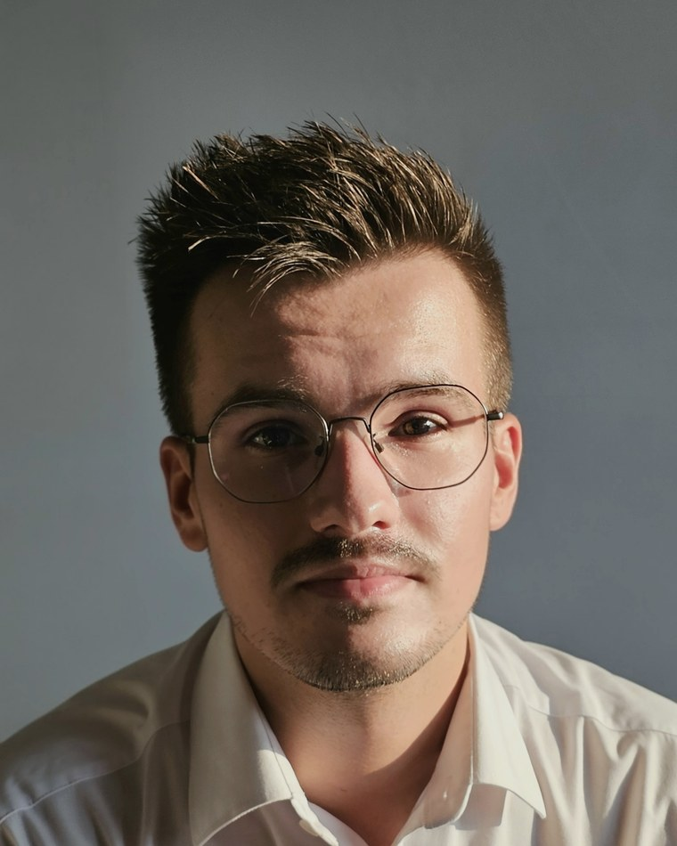

::: {.hero}
::: {.hero-text}
::: {.name}
Kamil Gacek, MBA
:::
::: {.role}
PhD Student in Economics and Finance 
Research and Teaching Assistant
:::
::: {.affil}
Department of Applications of Mathematics in Economics 
Faculty of Management, [AGH University of Krakow](https://www.agh.edu.pl/en) 
Krakow, Poland
:::
:::
{.portrait fig-alt="Portrait of Kamil Gacek"}
:::

## Keywords

::: {.tags}
- Input–Output Analysis
- Environmentally Extended IO
- Water Footprint
- Structural Decomposition Analysis
- Structural Path Analysis
- Dynamic Inoperability IO Models
- Drought and Disaster Risk
- Environmental Economics
- Applied Mathematics
:::

## Education and affiliations

I studied at the Jagiellonian University in Krakow, where I graduated in Mathematics in 2020,
in Applied Mathematics in 2022 and in Finance, Banking and Insurance in 2022; I completed an
MBA at WSB University in 2025. Since 2023 I have been a doctoral student in Economics and
Finance at AGH University of Krakow, writing a dissertation on Input–Output models in disaster
impact assessment under the supervision of Prof. Łukasz Lach. In October 2025 I joined the
Department of Applications of Mathematics in Economics at the Faculty of Management as a
Research and Teaching Assistant. Between 2024 and 2026 I also worked as a research assistant
in the POLPAN project at the Institute of Philosophy and Sociology of the Polish Academy of
Sciences. I sit on the Discipline Council for Economics and Finance at AGH and on the Projects
Team of the National Doctoral Council. I am a member of the International Input–Output
Association and the Polish Economic Society, and a 2025 participant of TopMinds, the mentoring
programme run by the Polish–American Fulbright Commission and Top 500 Innovators.

## Research

My work sits between environmental economics and applied mathematical modelling. I use
environmentally extended Input–Output frameworks to trace how a physical shortage — most often
of water — propagates through an economy: which sectors draw on it directly, which depend on it
through their supply chains, and how large the losses become once the disruption cascades.
Structural decomposition analysis for the 2010–2020 period lets me separate the drivers behind
changing water and waste intensities, from technological shifts to changes in final demand,
while backward and forward linkage analysis identifies the sectors that carry the highest water
footprint. Dynamic Inoperability Input–Output Models then translate a shortage into cumulative
economic losses along each sector's recovery path. In ongoing work with Prof. Joost R. Santos
at George Washington University this is combined with a Nature Value-at-Risk perspective to
quantify drought-induced systemic risk in Poland. The longer-term aim is an interactive model
that lets stakeholders simulate disruptions and test risk management strategies before a
drought arrives, rather than account for one after it has passed.
[See my research page for details](research.qmd), or go straight to the
[publications](publications.qmd).

## Industry

For the past five years I have worked in people analytics and HR data analysis in global
engineering organisations, currently as HR Data Analyst Partner at Jacobs and previously at
Aptiv, where I moved from an internship to a lead analyst role. The work covers workforce
data modelling, reporting automation and the kind of analysis that has to survive contact with
imperfect records and a deadline. Keeping one foot in practice makes me careful about what
data can actually support, and it trains the harder half of any quantitative project:
explaining a result to people who will act on it but do not read econometrics. The two tracks
turn out to ask the same question — what changes if this goes wrong — on different scales.
I am open to consulting and collaboration on quantitative projects.
[More on my industry work](industry.qmd).

## Elsewhere

::: {.linklist}
- [[]{.bi .bi-linkedin .profile-icon}[LinkedIn]{.linklist-label}](https://www.linkedin.com/in/kamil-gacek/)
- [[]{.ai .ai-google-scholar .profile-icon}[Google Scholar]{.linklist-label}](https://scholar.google.com/citations?user=Bo11EggAAAAJ&hl=pl)
- [[]{.ai .ai-researchgate .profile-icon}[Research Gate]{.linklist-label}](https://www.researchgate.net/profile/Kamil-Gacek-2)
- [[]{.ai .ai-orcid .profile-icon}[ORCID]{.linklist-label}](https://orcid.org/0009-0002-0235-3232)
- [[]{.ai .ai-cv .profile-icon}[Curriculum vitae]{.linklist-label}](files/CV_Kamil_Gacek.pdf)
:::
