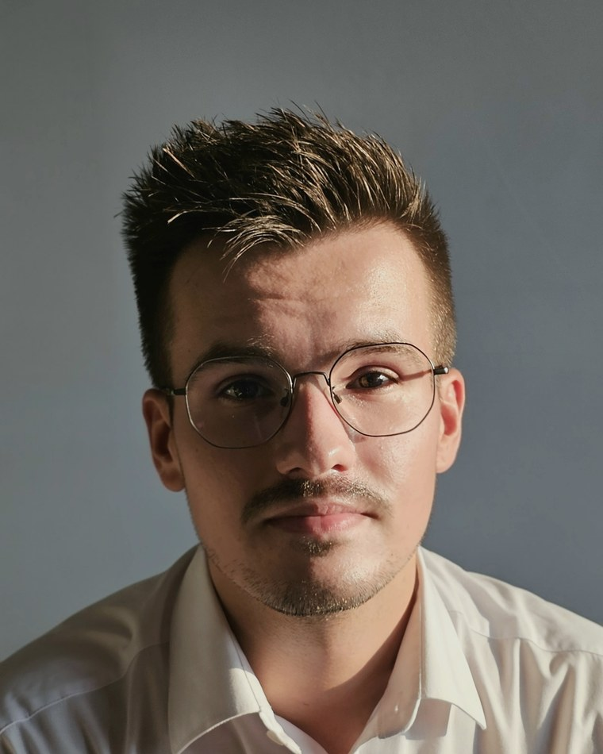

::: {.hero}
::: {.hero-text}
::: {.name}
Kamil Gacek, MBA
:::
::: {.role}
PhD Student in Economics and Finance 
Research and Teaching Assistant
:::
::: {.affil}
Department of Applications of Mathematics in Economics 
Faculty of Management, [AGH University of Krakow](https://www.agh.edu.pl/en) 
Krakow, Poland
:::
:::
{.portrait fig-alt="Portrait of Kamil Gacek"}
:::

## Keywords

::: {.tags}
- Input-Output Analysis
- Environmentally Extended IO
- Water Footprint
- Structural Decomposition Analysis
- Structural Path Analysis
- Dynamic Inoperability IO Models
- Drought and Disaster Risk
- Environmental Economics
- Applied Mathematics
:::

## Research

I am a Research and Teaching Assistant at the Faculty of Management, AGH University of Krakow.
My research combines environmental economics with applied mathematical modelling, and it starts
from a question that is harder than it looks:

::: {.pullquote}
What does a water shortage actually cost an economy that does not think of itself as
water-dependent?
:::

Most of the water an industry relies on it never touches. It arrives embedded in inputs - in
materials, energy, food, transport - which means that a drought hits sectors that have no visible
connection to it, and hits them late enough that the link is easy to miss. I use Input-Output
frameworks to make that structure visible, to attribute a rising water footprint to the forces
behind it, and to translate a shortage into the losses that accumulate along each sector's
recovery path. The point is to move the question from after to before: to let a shortage be
simulated rather than surveyed, and mitigation strategies compared before they are needed. You can
read more about my research [here](research.qmd).

Alongside this I have been a research assistant in the POLPAN project at the Institute of
Philosophy and Sociology of the Polish Academy of Sciences since 2024, working on statistical
analysis of the 1988-2023 longitudinal panel. I also sit on the Discipline Council for Economics
and Finance at AGH.

## Education

I studied at the Jagiellonian University in Krakow, where I completed a Bachelor's in Mathematics
(2020), a Master's in Applied Mathematics (2022) and a second Bachelor's, in Finance, Banking and
Insurance (2022). In 2025 I completed an MBA at WSB University in Krakow. Since 2023 I have been a
doctoral candidate in Economics and Finance at AGH University of Krakow, writing a dissertation on
Input-Output models in disaster impact assessment under the supervision of Prof. Łukasz Lach and
Dr Anna Dubel. In 2025 I took part in TopMinds, a mentoring programme run by the Polish-American
Fulbright Commission and Top 500 Innovators.

## Industry

For the past five years I have worked in people analytics in global engineering organisations -
currently as HR Data Analyst Partner at Jacobs, and before that at Aptiv, where I moved from an
internship to a lead analyst role. In both cases the work sits in a global team supporting the
whole organisation on HR analytics: ad hoc questions, individual reports and studies, modelling
and day-to-day support for the business, alongside long-running analytical projects that I take
through every stage, from the business context and the requirements to building, testing and
maintaining what comes out of them. You can read more about my industry work [here](industry.qmd).

## Elsewhere

::: {.linklist}
- [[]{.bi .bi-linkedin .profile-icon}[LinkedIn]{.linklist-label}](https://www.linkedin.com/in/kamil-gacek/)
- [[]{.ai .ai-google-scholar .profile-icon}[Google Scholar]{.linklist-label}](https://scholar.google.com/citations?user=Bo11EggAAAAJ&hl=pl)
- [[]{.ai .ai-researchgate .profile-icon}[Research Gate]{.linklist-label}](https://www.researchgate.net/profile/Kamil-Gacek-2)
- [[]{.ai .ai-orcid .profile-icon}[ORCID]{.linklist-label}](https://orcid.org/0009-0002-0235-3232)
:::

::: {.content-hidden when-format="html"}
<!-- CV wyłączone z wyświetlania. Żeby przywrócić, usuń ten blok i dodaj poniższą linię na końcu listy wyżej (zobacz też _quarto.yml). -->
- [[]{.ai .ai-cv .profile-icon}[Curriculum vitae]{.linklist-label}](files/CV_Kamil_Gacek.pdf)
:::
